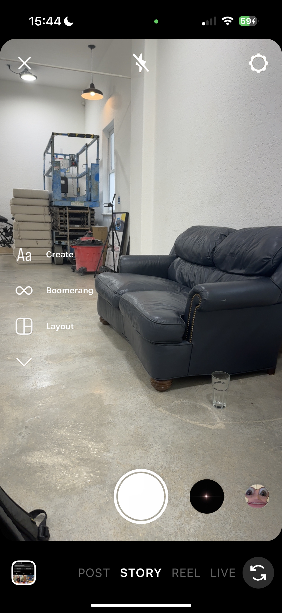

# Instagram Clone 📸

High-quality clone of the iOS Instagram app built with Swift, including the profile page, home feed, and content creation page. This project was created by [@brockthecoder](https://github.com/brockthecoder) for educational purposes and to showcase app development skills.

  

## Features

- Profile page with user information, profile picture, and user's posts
- Home feed with support for image carousels and reels
- Content creation pages for image/video capture
- UI adapts to screen size

## NOTICE
All design, logos, and icons are property of the Instagram company and used only for educational purpose